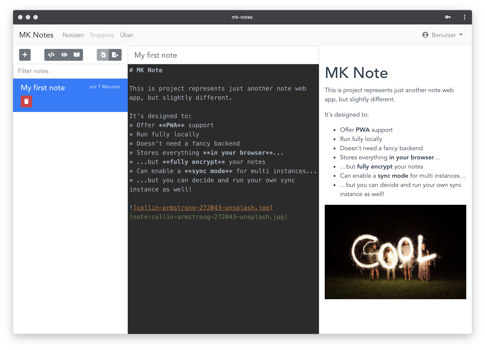

# MK Note

 [](https://www.codacy.com/app/Mo0812/MKNote?utm_source=github.com&amp;utm_medium=referral&amp;utm_content=Mo0812/MKNote&amp;utm_campaign=Badge_Grade)   [](https://app.netlify.com/sites/romantic-torvalds-50b43f/deploys)

MK Note is a note web app, which uses Markdown to render your notes. 

MK Note offers you:
* **Notes in Markdown:** Write notes in Github falvored Markdown
* **Preview:** Preview your written notes immediatly
* **Images:** Drag and Drop images and store them along with your notes
* **Offline:** Everything works totally offline, all the data is stored on your browser and on your machine - no fancy backend
* **Encrypted:** All your note data is encrypted by a password
* **Sync:** Even if its offline you can sync your notes over multi instances by running your own CouchDB backend
* **PWA:** Install your app on your compouter, and use it offline




## Use MK Note

Access your personal MK Note instance via: [https://notes.moritzkanzler.com](https://notes.moritzkanzler.com)

MK Note doesn't rely on any backend, so every computer which access the website above, will get it's own instance of MK Note immediatly.

You even can install MK Note as an app on your computer with Chrome.

## Install

If you dont want to use the tagged version of MK Note or contribute or extend it, just clone this repository and run the following command on your machine:

```
yarn build
```

The `dist/` folder contains everything you need to host your own version MK Note.

## Develop

Feel free and welcome to contribute or extend MK Note. All you need is to clone this repository run `yarn install` followed by `yarn serve` to recieve a hot-reloaded development environment.

PRs are welcomed!

## Sync instances

You can sync multiple instances over an own instance of CouchDB. The possibility is already implemented to do so. And a docker setup for hosting your own sync service will follow soon.

## Roadmap

Current features plans for MK Note can be found under [ROADMAP.md](ROADMAP.md) in this repository.

## Changelog

The current changelog can be found under [CHANGELOG.md](CHANGELOG.md) in this repository.